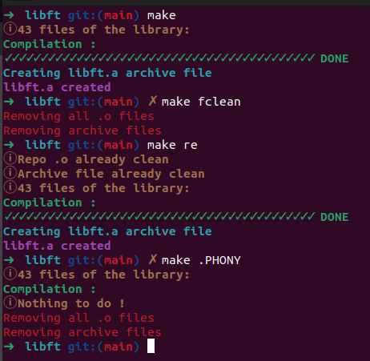
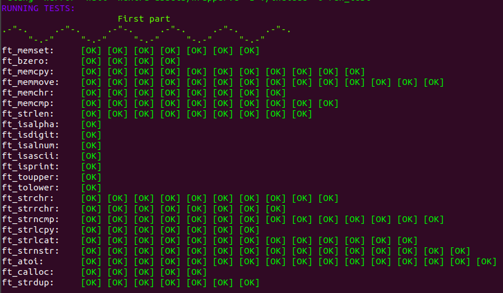
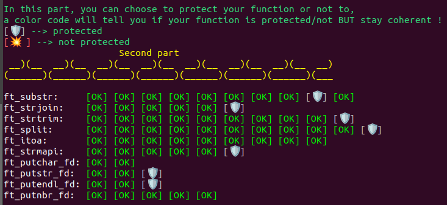
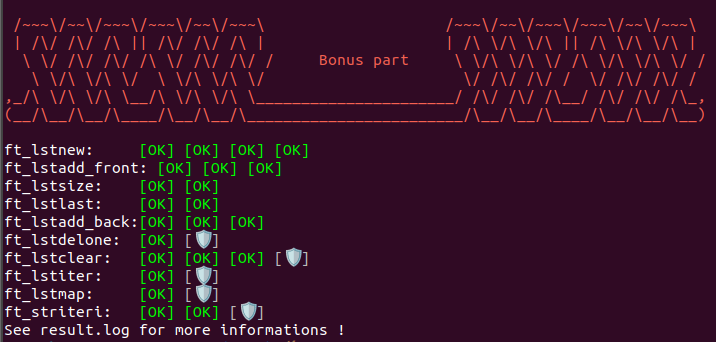

  
<p align="center">
	Ce projet t'a aidé ? Mets-lui une 🌟!
	
# Libft 📚

Ce projet a pour objectif de nous faire coder en C une librairie de fonctions usuelles que l'on pourra utiliser dans nos prochains projets.
Les seules fonctions externes autorisées sont `write()`, `malloc()` et `free()`. 
Tu peux trouver le sujet [ici](fr.subject.pdf).

## Télécharge et compile la librairie ⬇️

Clone la librairie.

```
git clone https://github.com/ugozchi/42_Libft.git
cd 42_Libft
```

## Options possibles ⚙️

Vous avez deux parties dans ce git, la première partie représentée ci-dessous avec `* .` correspond à tous les fichiers présents mise à part le dossier `TEST`. Ici, vous pouvez utiliser les options classiques d'un Makefile (options ci-dessous) mais aussi l'option bonus qui vous permettra d'ajouter vos fonctions bonus dans votre fichier archive libft.a si vous les avez fait.
Toute cette partie correspond à ce que l'on doit rendre pour ce faire corriger.
L'autre partie `TEST` sert attention tenez-vous bien à tester votre projet 🎉.


```
|- *.
|- TEST
```


| Option | Description |
| --- | --- |
| `make` | Compte, le nombre de fichier puis les compiles avant de créer un fichier archive libft.a avec tous les fichiers |
| `make clean` | Supprime le dossier contenant les fichiers objets |
| `make fclean` | Execute `clean` puis supprime le fichier archive |
| `make re` | Execute `fclean` puis `make` |
| 'make bonus` | Execute make puis rajoute les programmes bonus dans votre fichier archive |


## Tests  📋

Nous entrons donc dans la partie `TEST`. Vous retrouverez ici encore deux dossier, un dossier `libft` et un dossier libft-unit-test.
Le dossier libft contient exactement les mêmes fichiers que l'on a représentés tout à l'heure par ce symbole `* .`. La seule différence est dans le Makefile qui lui va nous donner plus d'informations lorsque que l'on va utiliser les différentes options du Makefile. 
L'éxecution du Makefile montre que tous nos programmes compilent sans soucis, que les fichiers objets et le fichier archive se créer bien et que tout peut être supprimé proprement.

| |
| --- |
|  |

Une fois cela vérifier, nous pouvons tester notre projet à l'aide de [/libft-unit-test](https://github.com/alelievr/libft-unit-test).
Voici les résultats :

### Première partie

| |
| --- |
|  |

### Deuxième partie

| |
| --- |
|  |

### Partie Bonus

| |
| --- |
|  |
