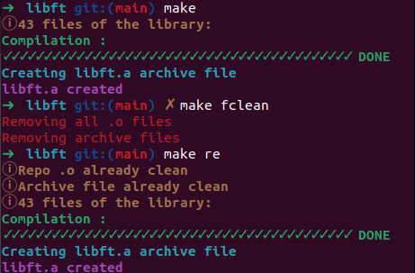

  
<p align="center">
	Ce projet t'a aidé ? Mets-lui une 🌟!
	
# Libft 📚

Ce projet a pour objectif de nous faire coder en C une librairie de fonctions usuelles que l'on pourra utiliser dans nos prochains projets.
Les seules fonctions externes autorisées sont `write()`, `malloc()` et `free()`. 
Tu peux trouver le sujet [ici](fr.subject.pdf).

<br>

## Télécharge et compile la librairie ⬇️

Clone la librairie.

```
git clone https://github.com/ugozchi/42_Libft.git
cd 42_Libft
```

<br>

## Options possibles ⚙️

Ici, vous pouvez utiliser les options classiques d'un Makefile (options ci-dessous) mais aussi l'option bonus qui vous permettra d'ajouter vos fonctions bonus dans votre fichier archive libft.a si vous les avez fait.  
Toute cette partie correspond à ce que l'on doit rendre pour ce faire corriger.
L'autre partie `TEST` sert attention tenez-vous bien à tester votre projet 🎉.

<br>

| Option | Description |
| --- | --- |
| `make` | Compte, le nombre de fichier puis les compiles avant de créer un fichier archive libft.a avec tous les fichiers |
| `make clean` | Supprime le dossier contenant les fichiers objets |
| `make fclean` | Execute `clean` puis supprime le fichier archive |
| `make re` | Execute `fclean` puis `make` |
| 'make bonus` | Execute make puis rajoute les programmes bonus dans votre fichier archive |

<br>

## Fonction disponible 🧾
- [Libft](#Libft)
	- [Fonctions mémoire](#fonctions-m%C3%A9moire)
	- [Fonctions chaînes de caractères](#fonctions-cha%C3%AEnes-de-caract%C3%A8res)
	- [Fonctions caractères](#fonctions-caract%C3%A8res)
	- [Fonctions nombres et calculs](#fonctions-nombres-et-calculs)
	- [Fonctions listes chaînées](#fonctions-listes-cha%C3%AEn%C3%A9es)
	- [Fonctions d'ouverture, fermeture, suppression... de File Descriptor](#fonctions-douverture-fermeture-suppression-de-file-descriptor)
	- [Fonctions d'affichage, lecture, écriture](#fonctions-daffichage-lecture-%C3%A9criture)

### Fonctions mémoire
Fonctions | Prototype | Description
--- | ---- | ---------------------
[ft_memset](ft_memset.c) | `void	*ft_memset(void *b, int c, size_t len);` | (cf. man) Remplit les n premiers octets de la zone mémoire pointée par s avec l'octet c. Renvoie un pointeur sur la zone mémoire s.
[ft_bzero](ft_bzero.c)  | `void	ft_bzero(void *s, size_t len);` | (cf. man) Met à 0 (octets contenant « \0 ») les n premiers octets du bloc pointé par s.
[ft_memcpy](ft_memcpy.c) | `void	*ft_memcpy(void *dst, const void *src, size_t n);` | (cf. man) Copie n octets depuis la zone mémoire src vers la zone mémoire dest. Les deux zones ne doivent pas se chevaucher (overlap). Si c'est le cas, utiliser plutôt ft_memmove. Renvoie un pointeur sur dest.
[ft_memmove](ft_memmove.c) | `void	*ft_memmove(void *dst, const void *src, size_t n);` | (cf. man) Copie n octets depuis la zone mémoire src vers la zone mémoire dest. Les deux zones peuvent se chevaucher (overlap).
[ft_memchr](ft_memchr.c) | `void	*ft_memchr(const void *s, int c, size_t n);` | (cf. man) Cherche c parmi les n premiers octets de la zone mémoire pointée par s. Renvoie un pointeur sur le premier octet correspondant, ou NULL si le caractère n'est pas présent.
[ft_memcmp](ft_memcmp.c) | `int		ft_memcmp(const void *s1, const void *s2, size_t n);` | (cf. man) Compare les n premiers octets des zones mémoire s1 et s2. Renvoie un entier négatif, nul ou positif si les n premiers octets de s1 sont respectivement inférieurs, égaux ou supérieurs aux n premiers octets de s2.
[ft_calloc](ft_calloc.c) | `void	ft_memalloc(size_t size);` | Alloue avec malloc(3) et retourne une zone de memoire "fraiche". La memoire allouee est intialisee a 0. Si l'allocation echoue, la fonction renvoie NULL.


### Fonctions chaînes de caractères
Fonctions | Prototype | Description
--- | ---- | ---------------------
[ft_strlen](ft_strlen.c) | `size_t	ft_strlen(const char *str);` | (cf. man) Calcule la longueur de la chaîne de caractères s, sans compter l'octet nul '\0' final.
[ft_strdup](ft_strdup.c) | `char	*ft_strdup(const char *s);` | (cf. man) Renvoie un pointeur sur une nouvelle chaîne de caractères qui est dupliquée depuis s.
[ft_strncpy](ft_strncpy.c) | `char	*ft_strncpy(char *dest, const char *src, size_t size);` | (cf. man) Identique à strcpy sauf que seuls les n premiers octets de src sont copiés. Avertissement : s'il n'y a pas de '/0' dans les n premiers octets de src, dest n'en aura pas non plus.
[ft_strlcat](ft_strlcat.c) | `size_t	ft_strlcat(char *dst, const char *src, size_t size);` | (cf. man) Concatène les deux chaînes et retourne la longueur totale de la chaîne qu'elle essaye de créer. Cela signifie la taille initiale de dst plus la longueur de src.
[ft_strchr](ft_strchr.c) | `char	*ft_strchr(const char *s, int c);` | (cf. man) Renvoie un pointeur sur la première occurrence du caractère c dans la chaîne s (ou NULL si non trouvé).
[ft_strrchr](ft_strrchr.c) | `char	*ft_strrchr(const crar *s, int c);` | (cf. man) Renvoie un pointeur sur la dernière occurrence du caractère c dans la chaîne s (ou NULL si non trouvé).
[ft_strnstr](ft_strnstr.c) | `char	*ft_strnstr(const char *hstack, const char *ndle, size_t n);` | (cf. man) Cherche la première occurrence de la sous-chaîne needle au sein des n premiers caractères de la chaîne haystack.
[ft_strncmp](ft_strncmp.c) | `int	ft_strncmp(const char *s1, const char *s2, size_t n);`| (cf. man) Identique à strcmp en ne comparant que les n (au plus) premiers caractères de s1 et s2.
[ft_striteri](ft_striteri.c) | `void	ft_striteri(char *s, void (*f)(unsigned int, char *));` | Applique la fonction f a chaque caractere de la chaine de caracteres passee en parametre en precisant son index en premier argument. Chaque caractere est passe par adresse a la fonction f afin de pouvoir etre modifie si necessaire.
[ft_strmapi](ft_strmapi.c) | `char	*ft_strmapi(char const *s, char (*f)(unsigned int, char));` | Applique la fonction f a chaque caractere de la chaine de caracteres passee en parametre en precisant son index pour creer une nouvelle chaine “fraiche” avec malloc(3) resultant des applications successives de f.
[ft_strjoin](ft_strjoin.c) | `char	*ft_strjoin(char const *s1, char const *s2);` | Alloue avec malloc(3) et retourne une chaine de caracteres "fraiche" terminee pas un '\0' resultant de la concatenation de s1 de s2. Si l'allocation echoue, la fonction renvoie NULL.*
[ft_strtrim](ft_strtrim.c) | `char	*ft_strtrim(char const *s);` | Alloue avec malloc(3) et retourne une copie de la chaine passee en parametre sans les espaces blancs au debut et a la fin de cette chaine. On considere comme des espaces blancs les caracteres ' ', '\n' et '\t'. Si s ne contient pas d'espaces blancs au debut ou a la fin, la fonction renvoie une copie de s. Si l'allocation echoue, la fonction renvoie NULL.
[ft_split](ft_strsplit.c) | `char	**ft_strsplit(char const *s, char c);` | Alloue avec malloc(3) et retourne un tableau de chaînes de caracteres "fraiches", résultant de la découpe de "s" selon le caractère 'c'. Le tableau et toutes les chaînes sont terminées par '\0'. Si l'allocation échoue, la fonction retourne NULL.
[get_next_line](get_next_line.c) | `int		get_next_line(int fd, char **line);` | La fonction GNL lit une ligne dans le file descriptor fd et complète la chaîne de caractères *line avec le résultat de la lecture (sans '\n' le cas échéant).
*"* | *"* | Une fin de lecture est définie par un '\n' ou un EOF (End Of File).
*"* | *"* | La fonction retourne 1 lorsqu'une ligne est lue ; 0 lorsque la lecture est terminée ; et -1 en cas d'erreur.


### Fonctions caractères
Fonctions | Prototype | Description
--- | -------- | ------------------
[ft_isalpha](ft_isalpha.c) | `int	ft_isalpha(int c);` | (cf. man) Prend un char en paramètre et renvoie 1 s'il s'agit d'un caractère alphabétique. Sinon 0.
[ft_isdigit](ft_isdigit.c) | `int	ft_isdigit(int c);`| (cf. man) Prend un char en paramètre et renvoie 1 s'il s'agit un chiffre. Sinon 0.
[ft_isalnum](ft_isalnum.c) | `int	ft_isalnum(int c);` | (cf. man) Prend un char en paramètre et renvoie 1 s'il s'agit d'un caractère alpha numérique (lettre ou chiffre). Sinon 0.
[ft_isascii](ft_isascii.c) | `int	ft_isascii(int c);` | (cf. man) Prend un char en paramètre et renvoie 1 s'il s'agit d'un caractère ASCII. Sinon 0.
[ft_isprint](ft_isprint.c) | `int	ft_isprint(int c);` | (cf. man) Prend un char en paramètre et renvoie 1 s'il s'agit d'un caractère imprimable. Sinon 0.
[ft_toupper](ft_toupper.c) | `int	ft_toupper(int c);` | (cf. man) Prend un char en paramètre et s'il s'agit d'une lettre minuscule, renvoie le char en majuscule. Sinon la fonction renvoie le char passé en paramètre.
[ft_tolower](ft_tolower.c) | `int	ft_tolower(int c);` | (cf. man) Prend un char en paramètre et s'il s'agit d'une lettre majuscule, renvoie le char en minuscule. Sinon la fonction renvoie le char passé en paramètre.


## Fonctions nombres et calculs
Fonctions | Prototype | Description
--- | -------- | ------------------
[ft_atoi](ft_atoi.c) | `int	ft_atoi(const char *str)` | (cf. man) Convertit une chaîne en entier.
[ft_itoa](ft_itoa.c) | `char	*ft_itoa(int n);` | Alloue avec malloc(3) et retourne une chaine de caracteres "fraiche" terminee par un '\0' representatnt l'entier n passe en parametre. Les nombres negatifs sont geres. Si l'allocation echoue, la fonction renvoie NULL.
[ft_abs](ft_abs.c) |  `int	ft_abs(int n);` | Prend en paramètre un int et renvoie sa valeur absolue.


### Fonctions listes chaînées
Fonctions | Prototype | Description
--- | ---- | ---------------------
[ft_lstnew](ft_lstnew.c) | `t_list	*ft_lstnew(void const *content, size_t content_size);` | Alloue avec malloc(3) et retourne un maillon “frais”. Les champs content et content_size du nouveau maillon sont initialises par copie des parametres de la fonction. Si le parametre content est nul, le champs content est initialise a NULL et le champs content_size est initialise a 0 quelque soit la valeur du parametre content_size. Le champ next est initialise a NULL. Si l’allocation echoue, la fonction renvoie NULL.
[ft_lstdelone](ft_lstdelone.c) | `void	ft_lstdelone(t_list **alst, void (*del)(void*, size_t));` | Prend en parametre l’adresse d’un pointeur sur un maillon et libere la memoire du contenu de ce maillon avec la fonction del passee en parametre puis libere la memoire du maillon en lui meme avec free(3). La memoire du champ next ne doit en aucun cas être liberee. Pour terminer, le pointeur sur le maillon maintenant libere doit etre mis a NULL (de maniere similaire à la fonction ft_memdel).
[ft_lstdel](ft_lstdel.c) | `void	ft_lstdel(t_list **alst, void (*del)(void*, size_t));` | Prend en parametre l’adresse d’un pointeur sur un maillon et libere la memoire de ce maillon et celle de tous ses successeurs l’un apres l’autre avec del et free(3). Pour terminer, le pointeur sur le premier maillon maintenant libere doit etre mis à NULL (de maniere similaire à la fonction ft_memdel).
[ft_lstadd](ft_lstadd.c) | `void	ft_lstadd(t_list **alst, t_list *new0);` | Ajoute l'element new en tete de la liste.
[ft_lstappend](ft_lstappend.c) | `void	ft_lstappend(t_list *new0, t_list *first_link);` | Ajoute l'element new en fin de liste.
[ft_lstiter](ft_lstiter.c) | `void	ft_lstiter(t_list *lst, void (*f)(t_list *elem));` | Parcourt la liste lst en appliquant a chaque maillon la fonction f.
[ft_lstmap](ft_lstmap.c) | `t_list	*ft_lstmap(t_list *lst, t_list *(*f)(t_list *elem));` | Parcourt la liste lst en appliquant à chaque maillon la fonction f et cree une nouvelle liste “fraiche” avec malloc(3) resultant des applications successives. Si une allocation echoue, la fonction renvoie NULL.


### Fonctions d'ouverture, fermeture, suppression... de File Descriptor
Fonctions | Prototype | Description
--- | ---- | ---------------------
[ft_open_fd](ft_open_fd.c) | `int	ft_open_fd(char *path, int oflag, int perm);` | Ouvre un fichier et attribue un file descriptor. Renvoie 1 en cas de succès, sinon -1 en cas d'erreur.
[ft_close_fd](ft_close_fd.c) | `int	ft_close_fd(int fd);` | Ferme un fd déjà ouvert. Renvoie 1 en cas de succès, sinon -1 en cas d'erreur.
[ft_remove](ft_remove.c) | `int	ft_remove(char *path);` | Supprime un fichier. Renvoie 1 en cas de succès, sinon -1 en cas d'erreur.
[ft_file_exists](ft_file_exists.c) | `int	ft_file_exists(char *path);` | Vérifie si un fichier existe en essayant de l'ouvrir en lecture seule. Renvoie 1 s'il existe, puis le ferme. Sinon 0 s'il n'existe pas.


### Fonctions d'affichage, lecture, écriture
Fonctions | Prototype | Description
--- | ---- | ---------------------
[ft_putchar_fd](ft_putchar_fd.c) | `void	ft_putchar_fd(char c, int fd);` | Ecrit le caractere c sur le descripteur de fichier fd.
[ft_putstr_fd](ft_putstr_fd.c) | `void	ft_putstr_fd(char const *s, int fd);` | Ecrit la chaine s sur le descripteur de fichier fd.
[ft_putendl_fd](ft_putendl_fd.c) | `void	ft_putendl_fd(char const *s, int fd);` | Ecrit la chaine s sur le descripteur de fichier fd suivi d'un '\n'.
[ft_putnbr_fd](ft_putnbr_fd.c) | `void	ft_putnbr_fd(int n, int fd);` | Ecrit l'entier n sur le descripteur de fichier fd.


## Tests  📋

Nous entrons donc dans la partie `TEST`. Vous retrouverez ici encore deux dossier, un dossier `libft` et un dossier libft-unit-test.
Le dossier libft contient exactement les mêmes fichiers que l'on a représentés tout à l'heure par ce symbole `* .`.  
La seule différence est dans le Makefile qui lui va nous donner plus d'informations lorsque que l'on va utiliser les différentes options du Makefile. 
L'éxecution du Makefile montre que tous nos programmes compilent sans soucis, que les fichiers objets et le fichier archive se créer bien et que tout peut être supprimé proprement.

<br>

| |
| --- |
|  |

<br>

Une fois cela vérifier, nous pouvons tester notre projet à l'aide de [/libft-unit-test](https://github.com/alelievr/libft-unit-test).

<br>

Voici les résultats :

### Première partie

<br>

| |
| --- |
|  |

<br>

### Deuxième partie

<br>

| |
| --- |
|  |

<br>

### Partie Bonus

<br>

| |
| --- |
|  |

<br>

## Note Final et Commentaires 📔

<br>

| |
| --- |
|  |


| | |
| --- | --- |
| Moulinette |  |
| Correcteur 1 |  |
| Correcteur 2 |  |
| Correcteur 3 |  |

